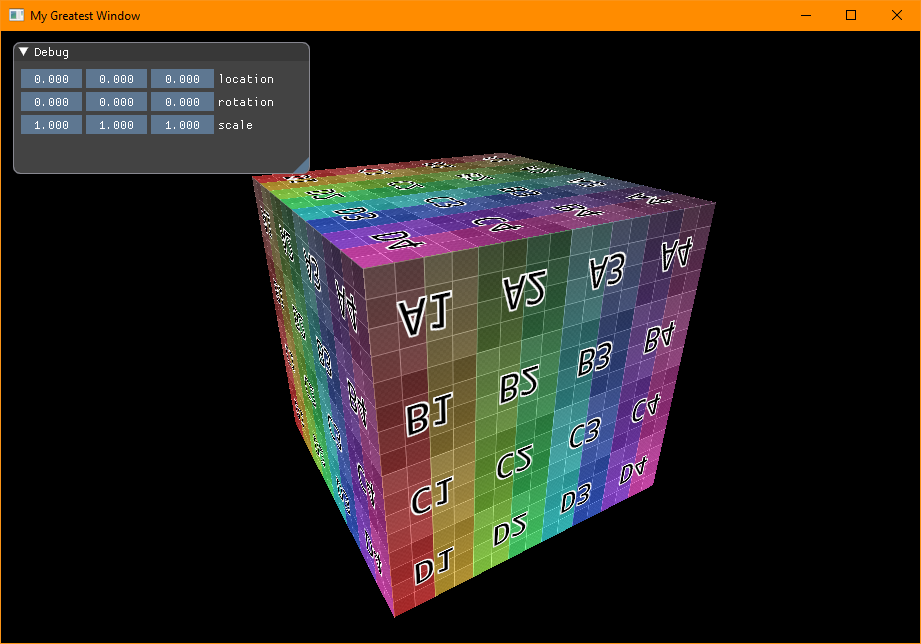
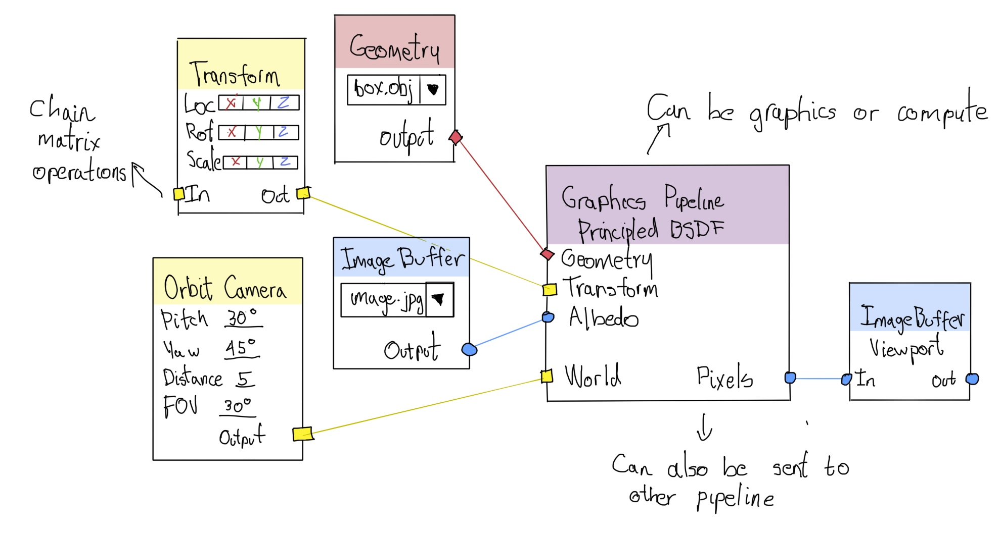

# reactor

`reactor` is a straightforward realtime graphics and compute engine, focused on
simplicity and learnability. It is a thin layer to abstract access to the GPU
capabilities.

`reactor` is a layer over Vulkan, and tries to map it's functionality to a easy
to use interface, and straightforward coding, the implementation is made to be
browsed and understood easily instead of being super high performant.
Nevertheless, it uses Vulkan API so it is expected to run reasonably well given
sensible inputs.

The main idea over `reactor` is to make easy to learn and experiment with
shaders to do graphics effects or manipulate data, avoiding the mess of having
to set up an environment. For now, the intention is to be able to easily code
vertex and pixel shaders for graphics effects, having some geometry or image as
input, and outputting to a file or to the screen.

As a data and graphics processing engine, `reactor` will have multiple ways to
input and output data. Initially I'm working on just loading images and
geometry, but I expect to be able to load CSV or other table data. On the long
term, the plan is to be able to have other inputs like mouse or keyboard for
interactive manipulation, and also sources like audio or video, be it from a
file or from a stream. I expect to be able to have audio and video outputs as
well.

This is an implementation for a basic program to show a 3d model in the
viewport. Please keep in mind that all the API is still work in progress.



```c++
#include "reactor.h"

int main()
{
	var engine = rEngine("My Great App"); // initialize the engine

	// create a window. this may not be needed for offline rendering.
	var window = rWindow(engine, "My Greatest Window", 1024, 1024); 

	// load a model from a file
	var geometry = rGeometry(engine, "content/cube.obj");

	// load a shader from a file
	var pipeline = rPipeline(engine, "shaders/basic.vert.spv", "shaders/basic.frag.spv", geometry);
	
	// scene is just a container to draw stuff, this will likely change.
	rScene scene;
	scene.primitives.push_back(&pipeline);
	window.scene = &scene;
	
	// some dynamic data, for the model transform and the camera state
	var transform = rTransform();
	// camera data is kept as primitive as possible (just pitch, yaw, distance)
	var camera = rOrbitCamera();

	// here is where the data is stored for sending to the GPU
	var projection = mat4(0.);
	// a GPU buffer to upload data.
	var projectionBuffer = rBuffer(engine, &projection, sizeof(mat4));
	// here the data is bound, I think there is a better way to abstract this.
	rPipelineUpdateDescriptorSets(pipeline, { { 0, 0, projectionBuffer } });

	// just loading and image and binding it, it can't get simpler than that.
	var image = rImage(engine, "content/link.jpg");
	rPipelineUpdateDescriptorSets(pipeline, { { 0, 1, image} });

	while ( rEngineStartFrame(engine)) // main loop
	{
		// this shows a window to be able to change `transform`
		rDebug(transform, "myTransform");
		// matrix of the transform, more of this below
		let model = rTransformMatrix(transform);

		// this checks mouse drag to rotate the camera
		rCameraTick(camera);

		// this process the rest of the matrix needs to render appropiately,
		// I think that with a better descriptor set abstraction, this may
		// not be needed.
		float aspect_ratio = float(window.width) / float(window.height);

		// prepare and send data to the GPU
		projection = rCameraProject(camera, model, aspect_ratio) * mat4::screen();
		rBufferSync(projectionBuffer);

		// render! (checks windows and scenes to know what to draw, still 
		// not sure about this.
		rEngineEndFrame(engine);
	}
	
	return 0;
}
```

I want to take some time to explain the thing about the matrices. Most of the
time in other software you use transform data (location/rotation/scale). And
they hide you the matrix behind it. `reactor` is designed to aid in the
understanding of things, so I wanted to be able to show things like how a
projection matrix morphs things as seen from one side for example. For me it is
important to allow this kind of experimentation. You can see an example of this
below.


I also want to highlight the simplicity, you just have a `main` function with
some setup, and an infinite loop with a straightforward interaction. There is no
need to subclass or extend anything, I think it is easy to integrate in some
way.

In addition to that, the idea in the future is to be able to set up your scene
in a visual graph, below you can find a couple examples of what it would look
like.


When I get to that point, I would like to have a library of commonly used
algorithms in videogames/visualization, such as PBR rendering, ambient
occlusion, and some image processing like edge detection, blur, etc... Keep in
mind that the whole idea behind this is to have a big library of knowledge easy
to approach.

Thanks for stopping by, if you are interested and would like to support this
project, please support me on Patreon, subscribe in Youtube and Twitch.


